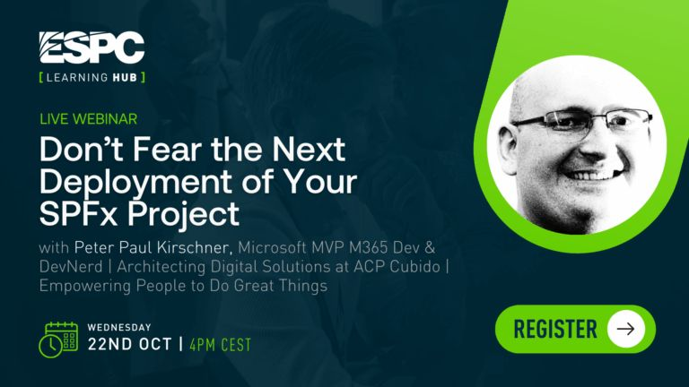

# ESPC 2025 Webinar 

## Don’t Fear the Next Deployment of Your SPFx Project




Deployments don’t have to be stressful. With the right pipeline in place, bringing SharePoint Framework solutions to production can be smooth and predictable. In this session we’ll explore how to design deployment pipelines in Azure DevOps or GitHub that fit your team’s way of working.

We’ll walk through different approaches to building and deploying SPFx projects, highlight how to manage configurations across environments, and show how to involve stakeholders with approvals where needed. You’ll see practical options ranging from lightweight pipelines for smaller teams to more advanced setups.

By the end you’ll know how to choose and implement the pipeline method that works best for you and your team, making every SPFx deployment a confident, repeatable, and stress-free experience.

[Video](https://www.sharepointeurope.com/webinars/dont-fear-the-next-deployment-of-your-spfx-project/)

## Structure

Pipelines in 1_22_0_Beta3.  (SPFX1.22.0.Beta3)

### 1. Single Pipeline Build & Deploy

**Path:** `01BuildDeploy/BasicWebPartCICD/`

**What it shows:**
A straightforward CI/CD that builds once and deploys immediately.

**Typical stages/steps:**

- Install toolchain: use a known Node version; `npm`.
- Quality gates: lint, unit tests (if present).
- (1.21.1) Build: `gulp bundle --ship` .
- (1.21.1) Package: `gulp package-solution --ship` → produces `.sppkg`.
- (1.22.0.Beta3) added npm task in `package.json`command ` "package-solution-prod": "heft build --production && heft package-solution --production"` .
- Publish artifacts: SharePoint package (`*.sppkg`) for the app catalog.
- Deploy: App Catalog (use Microsoft 365 CLI or PnP PowerShell to add/upgrade the `.sppkg`, approve, and optionally install to a site).

**When to use it:**
Small teams, single environment, fast iteration.

---

### 2. Multi-Stage Pipeline (Dev/Test/Prod)

**Path:** `02MultiStage/BasicWebPartMultiStage/`

**What it shows:**
Classic separation of concerns with approvals and per-environment settings.

**Typical stages:**

- Build (once): produce `.sppkg`  as artifacts.
- Deploy Dev → Test → Prod: Each stage reuses the same build artifacts.
- Environment-specific variables (site URLs,  tenant app catalog flags).
- Manual approvals or gates between stages.
- Same deployment mechanics as above (App Catalog operations).

**Why it’s helpful:**
Predictable promotions, fewer “it works on Dev only” surprises, controlled change flow.

---

### 3. Multi-Stage with API (SPFx + Azure Function)

**Path:** `03MultiStageWithAPI/react-chat-sk/`

**What the folder tells us:**

- `azure-function-sk/` – a function app scaffold to serve as the API backend.
- `react-chat-sk.sln` – .NET solution wrapper (the function may be C#), though some function samples are JS/TS—this layout is designed to demonstrate a real backend integration.
- `assets/`, `sharepoint/`, `src/`, `teams/` – SPFx front-end alongside the API.

**Typical pipeline stages:**

**Backend build/deploy (not in pipeline scope):**

- If C#: `dotnet build` and package; if JS/TS: `npm ci` and function packaging.
- Create/update Azure Function App.
- Configure app settings, secrets, and CORS to allow SharePoint/Teams origins.
- Deploy Dev → Test → Prod: Each stage reuses the same build artifacts.

**Frontend build abd deploy:**

- Each environment needs a build (because of EntraApp ID)
- Update `package-solution.json` and `globalConfig.ts` with  `"package-solution-prod": "node ./setGlobalConfig.js && node ./setApiPermissions.js && heft build --production && heft package-solution --production"`
- Add/upgrade `.sppkg` in App Catalog; optionally install to environment-specific sites.

**Why it’s helpful:**
Shows a full-stack pattern: SPFx web part talking to a secured, scalable API on Azure Functions.


## Download

[Download As Zip](https://download-directory.github.io?url=https://github.com/petkir/session-samples/tree/main/ESPC2025_Webinar&filename=ESPC2025_Webinar_petkir)


## Generating Certificate

```function CreateSelfSignedCertificate{
    Param(

   [Parameter(Mandatory=$true)]
   [string]$CommonName,

   [Parameter(Mandatory=$true)]
   [DateTime]$StartDate,

   [Parameter(Mandatory=$true)]
   [DateTime]$EndDate,

   [Parameter(Mandatory=$true)]
   [string]$Password
)

Write-host  $StartDate
    $cert = New-SelfSignedCertificate -Subject "CN=$CommonName" -FriendlyName $CommonName -NotBefore $StartDate -NotAfter $EndDate  -CertStoreLocation "Cert:\CurrentUser\My" -KeyExportPolicy Exportable -KeySpec Signature -KeyLength 2048 -KeyAlgorithm RSA -HashAlgorithm SHA256

    # Export Certificate from Variable to cert file to the location where script is executed
    Export-Certificate -Cert $cert -FilePath ".\$CommonName.cer"

    # Secure the file with password for enhanced security
    $mypwd = ConvertTo-SecureString -String "$Password" -Force -AsPlainText

    # Exporting the file to PFX file with Password
    Export-PfxCertificate -Cert $cert -FilePath ".\$CommonName.pfx" -Password $mypwd
}
$today = date
CreateSelfSignedCertificate -CommonName "CI-CD Deployment App Certificate" -StartDate $today   -EndDate $today.AddYears(10) -Password "TempP@ssw0rd"```

